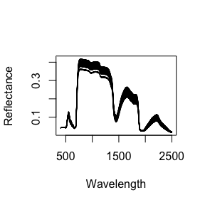
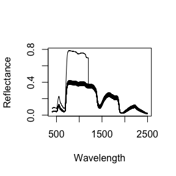

# Advanced spectrolab for package developers and contributors
Jose Eduardo Meireles and Anna K. Schweiger  

## Style guide and conventions

### Genral 

* object names are lower case
* assignment is done with equals `=` instead of arrow `<-`
* only really obvious abbreviations may be used
* names should be separated by undesrcore `_`, unless you're overloading an R generic e.g. `as.matrix`.
* internal functions should use the `i_` prefix. e.g `i_find_spectra()`
* all functions must be documented with roxygen2 comments
* strive for small functions.
* try to fail gracefully

### Specific

* **Do not reach inside the `spectra` object's guts**. If you're accessing the internal data structuresdirectly, you're probably doing something wrong.
* If the only way you can implement something reasonably is gutting the `spectra` object, we did something wrong. Please report an issue and submit a pull request.
* **Do not** use a pattern of deconstructing and reconstructing the `spectra` object, even if doing so though the getters and setters. 


```r
library("spectrolab")
```


## The spectra class

`spectrolab` defines a new S3 class called `spectra` that holds all of the different compnents of a spectral data.

Without diving too much into its implementation, a `spectra` object has 


class holds the essential information used in spectral dataset: reflectance, wavelengths, etc. The class has a bunch of requirements in terms of both format and values. 

Some of the requirements can be relaxed. For example, reflectance must by default be between 0 and 1, but you can pass `enforce01` to the `spectra()` constructor to supress this behaviour

## Constructing a `spectra` object _"by hand"_

Alternativelly to `read_spectra()` or `as.spectra()`, you can create a `spectra` object "by hand"" using the more flexible `spectra()` constructor, which takes at least arguments: (1) a reflectance matrix, (2) a vector of wavelengths and (3) the sample names.


```r
# (1) Create a reflectance matrix.
#     In this case, by removing the first column that holds the species name
rf = spec_matrix_example[, -1]

# (2) Create a vector with wavelength labels that match
#     the reflectance matrix columns.
wl = colnames(rf)

# (3) Create a vector with sample labels that match
#     the reflectance matrix rows.
#     In this case, use the first colum of spec_matrix_example
sn = spec_matrix_example[, 1] 

# Finally, construct the spectra object using the `spectra` constructor
spec = spectra(reflectance = rf, wavelengths = wl, names = sn)

# And hopefully this worked fine
is_spectra(spec)
```

```
## [1] TRUE
```

```r
plot(spec)
```

<!-- -->

## Getting and Setting

`spectrolab` gives you acess to get and set functions for most `spectra` components. The `names()`, `wavelengths()` functions do both getting and setting, as expected in T


```r
# Getters
names(spec)[1:4]
wavelengths(spec)[1:4]

# Setters
names(spec)       = toupper(names(spec))
```

Reflectances are set using the `[` notation. For instance:


```r
spec[1, 400:1200] = spec[1, 400:1200] * 2
plot(spec)
```

<!-- -->

You may want to fiddle with the reflectance itself. This is easy to do, but there are some constraints. For example, `spectrolab` will not allow you to have negative reflectance values or values greater than 1.

However, `spectrolab` will throw an error if you try to perform an illegal operation to reflectance, for instance 


```r
# Trying to add 1.0 to all reflectance values will fail.
spec[] = reflectance(spec) + 1.0
```
